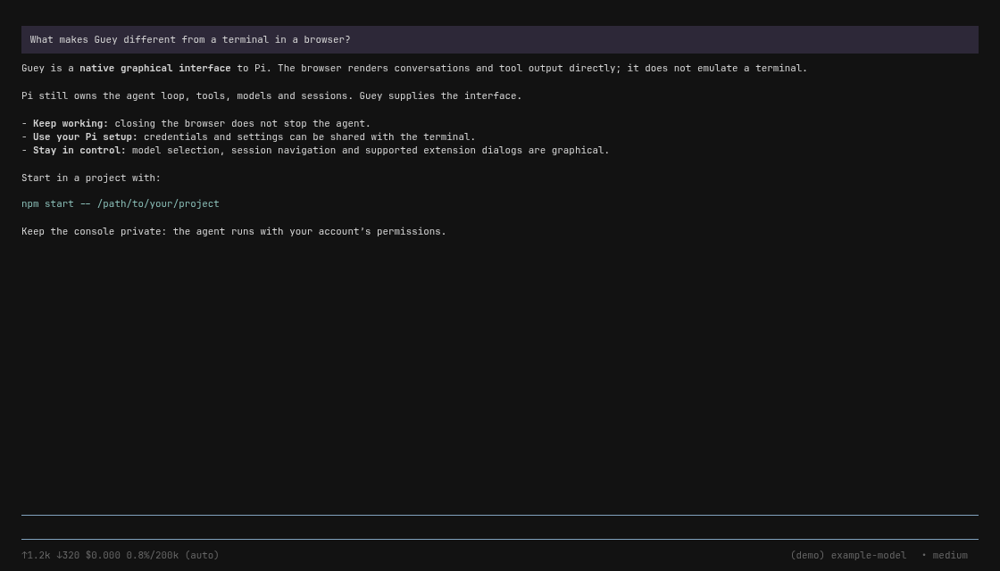

<div align="center">

# Guey

**Pi, in your browser.**

A native web interface for the Pi coding agent — not a terminal emulator, not a fork.

[Getting started](#getting-started) · [Security](SECURITY.md) · [Contributing](CONTRIBUTING.md) · [Architecture](docs/architecture.md)

</div>

---

Guey puts conversations, streaming tool output, models, sessions and provider sign-in into a browser. The stock Pi SDK still owns the agent loop, tools, persistence and extensions. Close the browser and Pi keeps running; reconnect to pick up where you left off.

**Early preview.** Built against Pi **0.85.0**. Full terminal-interface parity and arbitrary terminal-only extension widgets are not supported. This is an independent project, not an official Pi release.



*The real interface with a synthetic example conversation; no private session or model call. Reproduce with `node scripts/screenshot.mjs`.*

## Getting started

You need **Linux**, **Node.js 22.19+**, npm, bash, `flock` (util-linux), and a modern browser. `npm ci` installs the Pi **Node SDK** (0.85.x). A compiled `pi` binary on PATH is not enough by itself — Guey imports the library, it does not shell out to the CLI.

```sh
git clone https://github.com/locusrifle/guey-pi.git
cd guey-pi
npm ci
npm start -- /absolute/path/to/your/project
```

The launcher prints a loopback URL and opens your browser. If your desktop cannot open it automatically, open the printed URL yourself.

- Already use Pi? Guey uses your `~/.pi/agent` credentials, models and settings.
- New to Pi? Choose **Use a subscription / sign in** or **Use an API key** in the setup panel. Provider access and billing are your responsibility. No model call starts until you send a prompt.
- Guey keeps a **separate session archive** in its application state. It does not silently resume your terminal's active session.

> **This is a shell-capable application, not a sandbox.** The agent has your account's file and command permissions. It has no application access-control login: provider sign-in is not server authentication. Keep it on loopback or a trusted private network. Never expose it through a public proxy or tunnel.

## Everyday use

```sh
./desktop/guey status       # endpoint and process
./desktop/guey stop         # stops Pi too; aborts an active turn
./desktop/guey start        # starts again, or reopens the existing app
```

Use `/model` to choose a model, `/new` for a fresh conversation, `/resume` for the session picker, `/login` for provider setup and `/logout` to remove stored provider credentials. Those credentials are shared with terminal Pi by default: signing out here affects that shared profile.

Closing a tab **does not** stop the agent. Stop Guey before updating or uninstalling. Updating the source does not hot-reload an existing process.

See the [Linux launcher guide](desktop/README.md) for state paths, headless operation, private-network configuration and portable archive installation.

## Optional terminal bridge

The `guey-live` extension advertises an already-running terminal Pi to Guey. It enables watching and supported remote actions without opening that terminal's session file as a second writer.

With a matching Pi CLI installed, from this checkout:

```sh
pi install .
```

Reload an idle terminal Pi with `/reload`. Installation changes Pi's package configuration; it is not needed to run the GUI. Terminals without the bridge are invisible to its ownership guard. Do not manually run two writers against one session file.

## Develop and test

```sh
npm ci
npx playwright install chromium
npm test                   # runtime and integration tests
npm run test:browser        # real Chromium, scripted agent runtime
npm run test:auth           # real SDK, fake provider credentials
npm run test:all            # all native and extension tests
npm run build:desktop       # Linux archive plus checksums in dist/
npm run test:desktop        # extracted archive and installer checks
```

Tests do not intentionally perform paid model turns or real provider authorization. Browser tests can skip when Chromium is unavailable; a skip is not verification. CI installs Chromium explicitly. Release evidence and remaining checks are recorded in [docs/release.md](docs/release.md).

## Built to be used, and built on

The default application is **Guey**: a neutral graphical Pi interface. The repository also contains **locusrifle**, an experimental personal composition that exercises the same foundation with a drop-down interface, canvas and desktop integration. Those features are not stock defaults, and do not require any personal services to run Guey.

See [the architecture](docs/architecture.md) for that boundary and current compatibility limits.

## License and credits

[MIT licensed](LICENSE). Use it, change it, build on it. Third-party code retains its own licenses: [notices and attribution](THIRD_PARTY_NOTICES.md).
